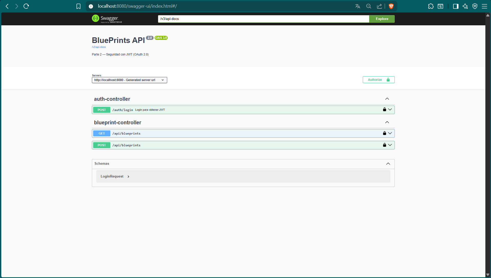

# Lab 5 ARSW 2026-1
## Autor: Juan Felipe Ochoa Guerrero

## Primera parte: Análisis configuración de seguridad
Para esta primera parte se haá un recorrido por la configuración de seguridad entendiendo que tipo de seguridad tienen
los endpoints. Lo primero que se destaca es que los endpoints de /actuator/health y /auth/login, además de los endpoints
de Swagger son públicos al tener .permitAll(). Los endpoints de /api/**/ necesitan autenticación y un scope definido que será
blueprints.read o blueprints.write. Por último, están los demás endpoints que también necesitan autenticación, pero sin
scope determinado.

## Segunda parte: Análisis del endpoint de login y claims del JWT
Lo primero que se hace es comparar el usuario y contraseña con el servicio, para saber si el usuario está creado, si 
no lo está, retorna un error 401, de lo contrario sigue el proceso. Posterior a ello se definen los claims del JWT
donde se encuentran el creador (issuer), el momento en que se emitió (issuedAt(now)), cuando expira(expiresAt(exp)),
el nombre de usuario (subject(req.username())) y el scope (claim("scope", scope)).
Luego se firma, se encripta y se realiza el POST.

## Tercera parte: Scopes para endpoints
Lo que se hizo fue asignar scope de read a todos los endpoints GET, y añadir scope de write a todos los POST y PUT del
laboratorio pasado.

## Cuarta parte: Definición del tiempo del token
Para esta parte del laboratorio se cambiará la duración del token a 60 segundos. Para ello, en application.yml se cambiará
la variable token-ttl-seconds de 3600 a 60.

## Quinta parte: Swagger
